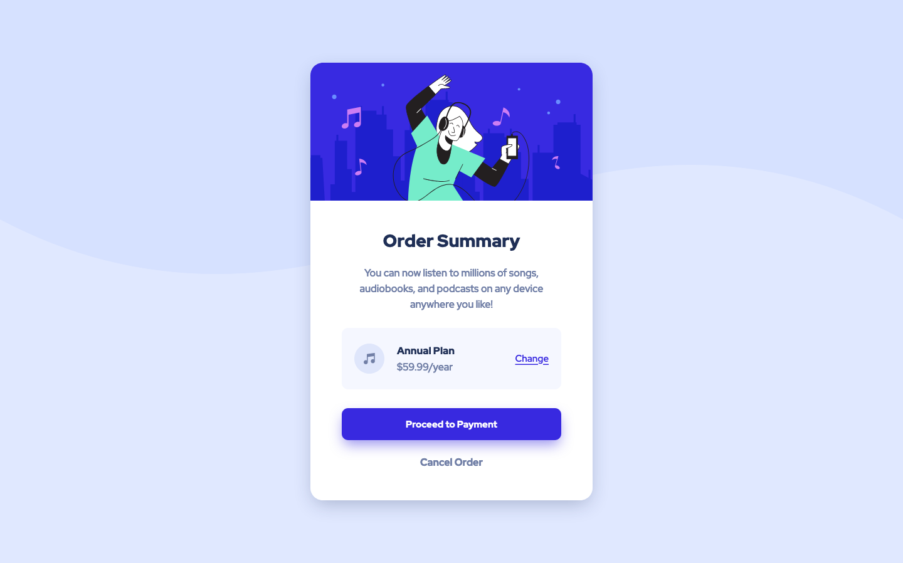

# Frontend Mentor - Order Summary Card Solution

This is a solution to the [Order Summary Card Challenge on Frontend Mentor](https://www.frontendmentor.io/challenges/order-summary-component-QlPmajDUj).

## Table of contents

- [Overview](#overview)
  - [The challenge](#the-challenge)
  - [Screenshot](#screenshot)
  - [Links](#links)
- [My process](#my-process)
  - [Built with](#built-with)
  - [Useful resources](#useful-resources)
- [Author](#author)

## Overview

### The challenge

Users should be able to:

- See hover states for interactive elements

### Screenshot

### Links

- Solution URL: [https://www.frontendmentor.io/solutions/order-summary-component-with-html-and-css-TVyM4Og4-](https://www.frontendmentor.io/solutions/order-summary-component-with-html-and-css-TVyM4Og4-)
- Live Site URL: [https://rafo38kh.github.io/order-summary/](https://rafo38kh.github.io/order-summary/)

## My process

### Built with

- Semantic HTML5 markup
- CSS custom properties
- CSS Flexbox

## Author

- Frontend Mentor - [@rafo38kh](https://www.frontendmentor.io/profile/rafo38kh)
- GitHub - [@rafo38kh](https://github.com/rafo38kh)
- Codewars - [@rafo38kh](https://www.codewars.com/users/rafo38kh)
